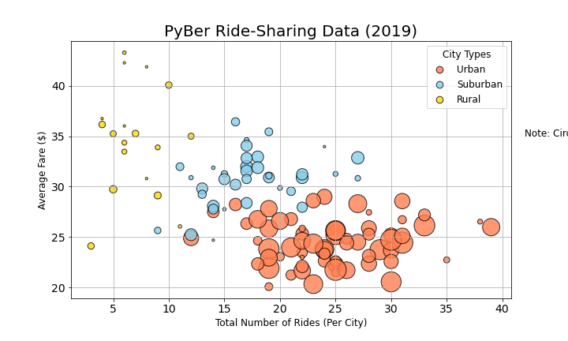
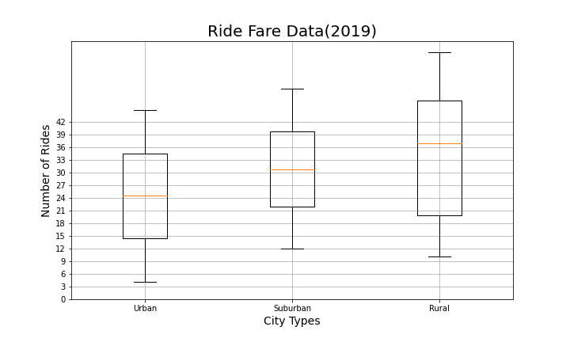
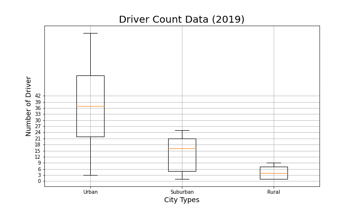
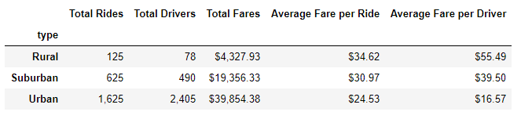
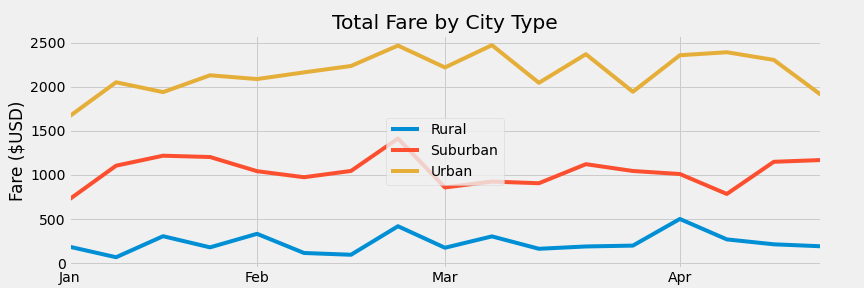

# PyBer_Analysis
Creating and annotating graphs and charts using the Matplotlib library.

## Project Background and Goals

* Matplotlib has a rich set of features for creating and annotating charts that visualize data in a Data Series or DataFrame.
* This is a data analyst project at PyBer, a ride-sharing app company valued at $2.3 billion and we need to analyze all the rideshare data from January to early May of 2019 and create a compelling visualization using Matplotlib and SciPy statistics.

* Here is the list of deliverables for the analysis of the PyBer analysis:

    - Perform exploratory analysis on data from large csv files.
    - Create a bubble chart that showcases the average fare versus the total number of rides with bubble size based on the total number of drivers for each city type, including urban, suburban, and rural.
    - Determine the mean, median, and mode and create box-and-whisker plots that visualize the number of rides, the fares, and the number of drivers for each city type.
    - Create a pie chart that visualizes each of the percent of total fares, total rides, and total drivers for each city type.

* This analysis improves the access to ride-sharing service and determining the affordability for underserved neighborhoods.

## The process of project

* Read raw data in csv file.
* Clean and inspect data, correct inappropriate data.
* Merge datasets to create new DataFrame gathering more information.
* Perform calculations for key metrics use groupby() function.
* Visualize data with tables to tell story and showcase trends.

## Software/Tools/Libraries
* Python 3.7.6, Jupyter Notebook 6.1.4 with PanDas, NumPy, Matplotlib, and SciPy statistics.
* Data Source: city_data.csv, ride_data.csv.

## Results of project
1. The ride-sharing bubble chart shows the total number of rides per city. One bubble chart has all the city types with the different colors.

2. The mean, median, and mode of the number of rides, the fares, and the number of drivers for each city type and create box-and-whisker plots with the statistics
* Number of ride per the city type

* Ride fare data per the city type

* Driver Count Data per the city type

3. Pie chart to visualizes each of the percent of total fares, total rides, and total drivers for each city type.

* Ride percentage the city type

* Fare percentage per the city type

* Driver percentageper the city type

# Challenge

#### Challenge Goal

* Create a summary DataFrame of the ride-sharing data by city type using groupby(), count(), sum() fuctions.
* Create a multiple-line graph that shows the total weekly fares for each city type using pivot() and resample(), and loc() functions.

## Results of project

#### A ride-sharing summary DataFrame by city type

* The Suumary DataFrame of total ride, drivers, fares, average fares per ride and drivers.

Summary Table Conclusion:
By comparing the average fare per rides between each city type, rural cities have highest average fare per ride than suburban and urban by around four dollars and 10 dollars, respectively.
For the column of average fare per driver, rural cities also perform well than suburban and urban cities by 40% and 230%. The reason is that the rides and drivers count of rural cities, significantly lower than urban and suburban cities. It leads to average values greater than urban and suburban.

#### A multiple-line chart of total fares for each city type

Multiple-Line Plot conclusion:
This multiple-line charts showcases the total fare per city type changes by times. The X axis shows date from 1/1/2019 to 4/28/2019, and total fare in Y axis. In that line chart, Urban cities have highest total fares all the time, and Rural cities are lowest all over time. Suburban's line is in the middle.

Furthermore, the urban's line shows there are several peaks in March and April. At the same time, the line of rural shows some correlation to Urban's line. For example in the first week of March, urban's total fares are over 2,500 dollars. In parallel to that, rural's line reaches the lowest point, less than 360 dollars.

#### Summaries

* Total numbers of rides, drivers, fares, average fare per ride and drivers for each city type have beend retrieved by groupby(), count(), and sum() fuctions. 
* A DataFrame was created using the groupby(), pivot(), loc(), and resample fuctions and annotated chart in weekly bins showing the total fares by city type is created.
* From a multiple-line chart, urban cities have highest total fares all the time, and Rural cities are lowest all over time. Suburban's line is in the middle.

